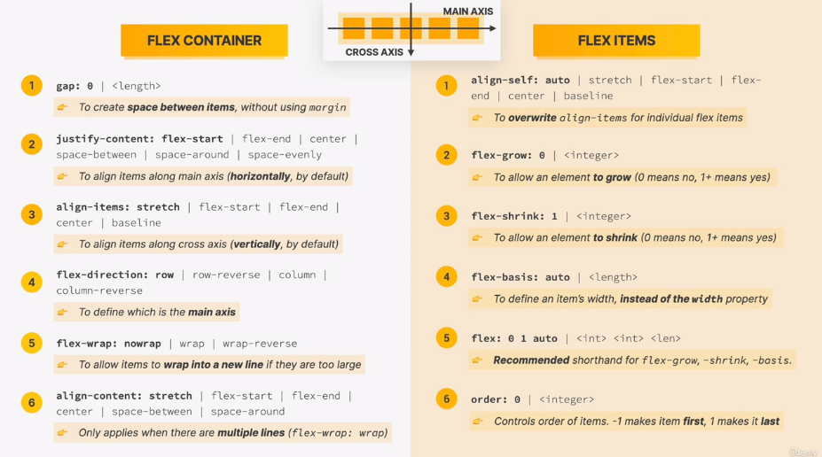
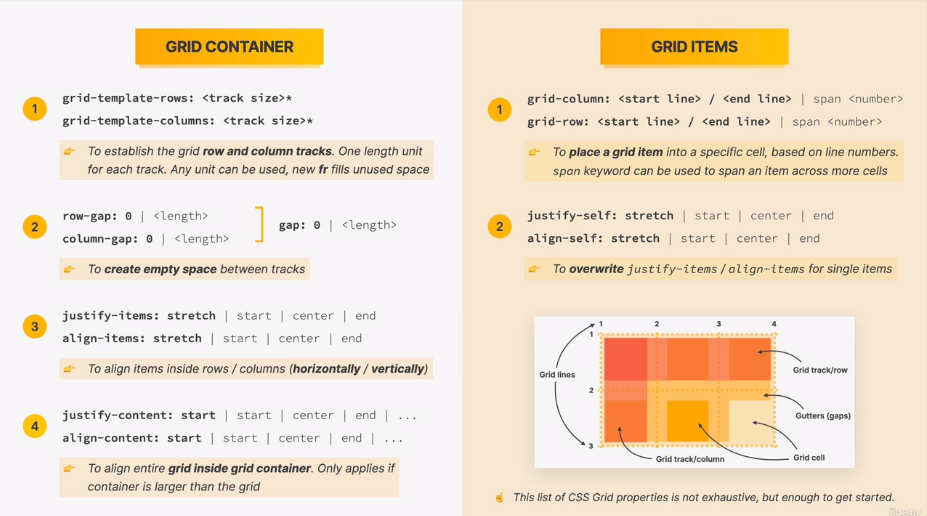

## Links

[Original source code](https://github.com/jonasschmedtmann/html-css-course)  
[Omnifood website](https://omnifood.dev/)  
[Course Resources](https://codingheroes.io/resources/)  
[Check features compatibility with browsers](https://caniuse.com/)  
[Open Color](https://yeun.github.io/open-color/)    
[Paletton](https://paletton.com/#uid=1000u0kllllaFw0g0qFqFg0w0aF)  
[Coolors - Color Contrast Checker](https://coolors.co/contrast-checker/112a46-acc8e5)  
[Heroicons](https://heroicons.com/)  
[ionicons](https://ionic.io/ionicons)  
[Emoji](https://getemoji.com/)  
[CSS Tricks](https://css-tricks.com/)  
[MDN CSS text-align](https://developer.mozilla.org/en-US/docs/Web/CSS/text-align)  
[HTML Validator](https://validator.w3.org/)  
[Diff Checker](https://www.diffchecker.com/)  
[Codepen](https://codepen.io/)  
[Section 2 - Challenge 2](https://codepen.io/jonasschmedtmann/pen/ZELVmJX/48f20ea036df9afc09978b07eca226b8)  
[Section 3 - Challenge 1](https://codepen.io/jonasschmedtmann/pen/zYNyMJL/256706a9de79baf1bd19abcb68e820d9)  
[Section 3 - Challenge 2](https://codepen.io/jonasschmedtmann/pen/oNBJQOr/bc1ffc43d2c2d6dfb311d99f974ec991)  
[Section 3 - Challenge 3](https://codepen.io/jonasschmedtmann/pen/dyNwwGP/7a64f0845fd4f6439b63203371edbcb1)  
[Section 4 - Challenge 1](https://codepen.io/jonasschmedtmann/pen/eYgbXrV/1a12771af64312342aa5a5f45bd2347c)  
[Section 4 - Challenge 2](https://codepen.io/jonasschmedtmann/pen/MWJZZQL/c8e97f50f726b8e57ff58068647cde00)  
[Section 4 - Challenge 3](https://codepen.io/jonasschmedtmann/pen/wvgREqP/ddc3ec3843c753ee03e9525df6c4a1f1)  

  

  
